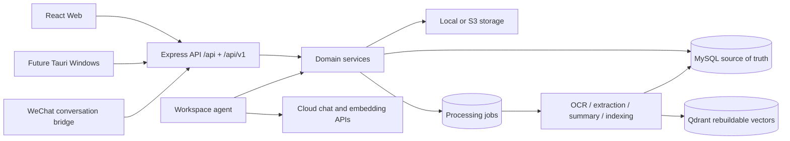

# Personal Intelligent Workspace Architecture

The system remains a modular monolith. `apps`, `packages` and `agents` are ownership boundaries inside one deployable Node.js application, not independently operated microservices.

## Invariants

- MySQL is authoritative; Qdrant is disposable and rebuildable.
- Files live outside database rows and should live outside release directories in production.
- User-created taxonomy is authoritative. AI can only use existing folders and tags.
- Cloud-bound content is redacted and respects per-record AI visibility.
- Agent writes always enter the approval table.
- Existing `/api/*` endpoints remain available during migration.
